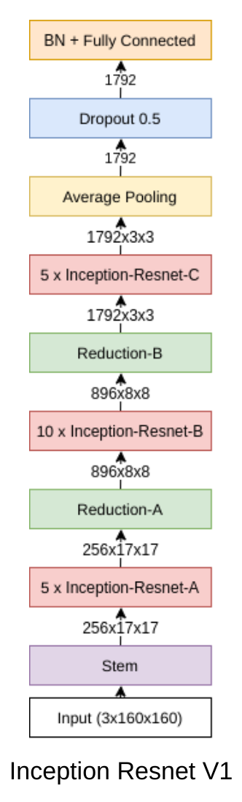
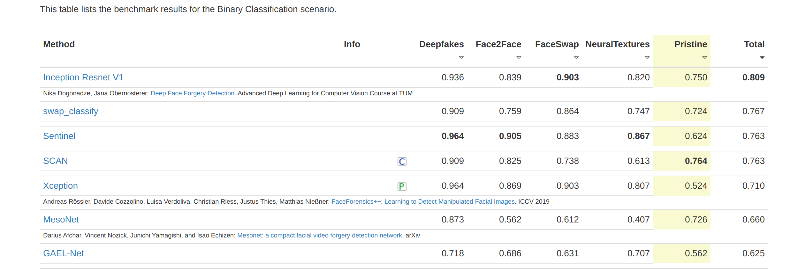
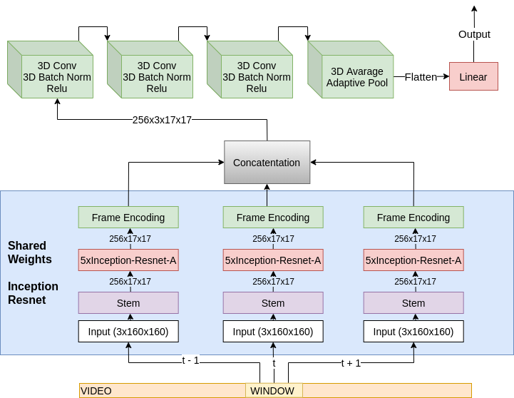
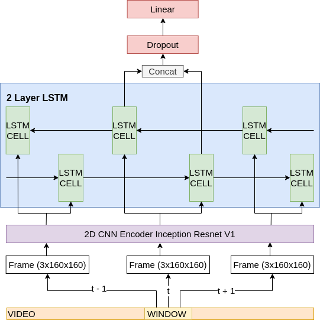

## DeepFaceForgery Detection
This repository contains code for deep face forgery detection in video frames. This is a student project from [Advanced Deep Learning for Computer Vision](https://dvl.in.tum.de/teaching/adl4cv-ws18/) course at [TUM](https://www.tum.de/).

### Dataset and technologies
For detecting video frame forgeries we use [FaceForensics++](http://www.niessnerlab.org/projects/roessler2019faceforensicspp.html) dataset of pristine and manipulated videos. As a preprocessing step we extract faces from all the frames using [MTCNN](https://github.com/ipazc/mtcnn).
Total dataset is ~507GB and contains 7 million frames. Dataset downloading and frame extraction code is located in [dataset](dataset) directory.
For model training, we use the split from [FaceForensics++](http://www.niessnerlab.org/projects/roessler2019faceforensicspp.html) repository.

Main technologies:
1. `Python` as main programming language
2. `Pytorch` as deep learning library
3. `pip` for dependency management

### Training/Evaluation
All the training and evaluation code together with various models are stored in [src](src) directory. All scripts are self-documenting. Just run them with `--help` option.
They automatically use gpu when available, but will also work on cpu, but very slowly, unfortunately.

### Single frame model
We got the best single-frame classification accuracy using a version of [Inception Resnet V1 model](src/model.py#L109) pretrained on VGGFace2 face recognition dataset.

### FaceForensics Benchmark
By training this model on all the data mentioned above we got state of the art results on [faceforenics benchmark](http://kaldir.vc.in.tum.de/faceforensics_benchmark/) 

### Window frame models
We also evaluated how performance improves when incorporating temporal data. The task in this case changes from single frame classification to frame sequence classification. 
We used 2 different models for such an approach 3D convolutional and Bi-LSTM. 

#### 3D convolutional model
  
Temporal feature locality assumption that 3D convolutional model has, seems reasonable in this case, but it is very slow to train for large window sizes.

#### LSTM with 2D CNN encoder
  
